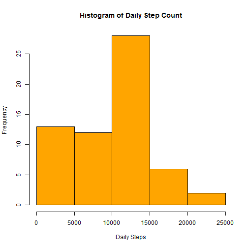
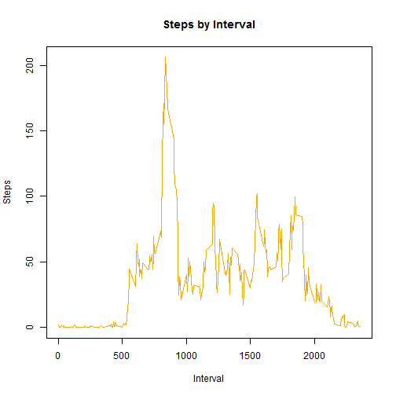
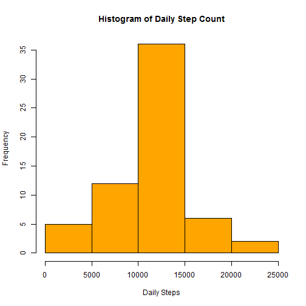
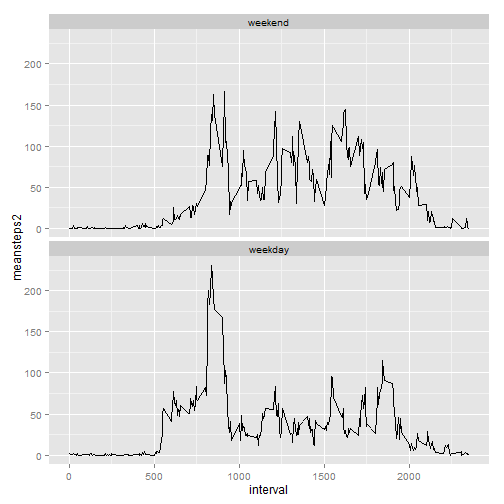

# Introduction

It is now possible to collect a large amount of data about personal movement using activity monitoring devices such as a Fitbit, Nike Fuelband, or Jawbone Up. These type of devices are part of the "quantified self" movement -- a group of enthusiasts who take measurements about themselves regularly to improve their health, to find patterns in their behavior, or because they are tech geeks. But these data remain under-utilized both because the raw data are hard to obtain and there is a lack of statistical methods and software for processing and interpreting the data.

This assignment makes use of data from a personal activity monitoring device. This device collects data at 5 minute intervals through out the day. The data consists of two months of data from an anonymous individual collected during the months of October and November, 2012 and include the number of steps taken in 5 minute intervals each day.


###Note:

- You need to download Activity monitoring data to your working directory. 
        
        Dataset: "https://d396qusza40orc.cloudfront.net/repdata%2Fdata%2Factivity.zip"
        


###Loading and preprocessing the data        
        

```r
library(knitr)
activity<-read.csv("activity.csv")
activity$date<-as.Date(activity$date)
```


###What is the mean total number of steps taken per day? 


```r
#histogram of total steps taken each day
        
        library(dplyr)
        stepsbyday<-summarise(group_by(activity, date), steps=sum(steps, na.rm=TRUE))
                              
        hist(stepsbyday$steps, 
                col="orange",
                xlab="Daily Steps",
                main="Histogram of Daily Step Count")
```

 

```r
#calculate mean steps taken each day
        mean<-mean(stepsbyday$steps, na.rm=TRUE)
        print(paste("The mean number of steps is:",mean,"."))
```

```
## [1] "The mean number of steps is: 9354.22950819672 ."
```

```r
#calculate median steps taken each day
        median<-median(stepsbyday$steps, na.rm=TRUE)
        print(paste("The median number of steps is:", median, "."))
```

```
## [1] "The median number of steps is: 10395 ."
```


The mean steps per day is 'r mean' and the median is 'r median'. 


###What is the average daily activity pattern?

1. Make a time series plot of the 5 minute interval and the average number of steps taken, averaged across all days.


```r
        stepsbyinterval<-summarise(group_by(activity, interval), 
                                   meansteps=mean(steps, na.rm=TRUE))
        plot(stepsbyinterval$meansteps~stepsbyinterval$interval, 
             type="l", 
             main = "Steps by Interval",
             ylab = "Steps", 
             xlab = "Interval",
             col = "orange")
```

 

2. Which 5 minute interval, on average across all days, contains the maximum number of steps? 

```r
        maxint<-as.integer(stepsbyinterval[stepsbyinterval$meansteps ==
                                                max(stepsbyinterval$meansteps),1])
        
        print(paste("The inverval with the most average steps is", maxint))
```

```
## [1] "The inverval with the most average steps is 835"
```
The max interval is 'r maxint'.


###Imputing missing values

1. Calculate and report the total number of missing values in the dataset (i.e. the total number of rows with NAs)


```r
        missingvals<-sum(complete.cases(activity))
        print(paste("There are", missingvals, "missing values."))
```

```
## [1] "There are 15264 missing values."
```


2. Devise a strategy for filling in all of the missing values in the dataset. The strategy does not need to be sophisticated. For example, you could use the mean/median for that day, or the mean for that 5-minute interval, etc.

All missing (NA) values for 'steps' will be filled in by using the mean for that particular interval. i.e. if interval 3 is missing from 11-10-2010, the NA will be replaced with the mean value for the group of interval 3 across all days (with NAs removed).

3. Create a new dataset that is equal to the original dataset but with the missing data filled in.


```r
#replace missing values with the mean value for that interval
        
activity2<-activity %>%
        group_by(interval) %>% 
        mutate_each(funs(replace(., which(is.na(.)),
                                 mean(., na.rm=TRUE))), steps)
```


4. Make a histogram of the total number of steps taken each day and Calculate and report the mean and median total number of steps taken per day. Do these values differ from the estimates from the first part of the assignment? What is the impact of imputing missing data on the estimates of the total daily number of steps?

*Yes, imputing the missing values makes a difference. Due to the large number of missing values the mean and median values converge, and the peak is more defined.* 


```r
        #histogram of total steps taken each day
        
        stepsbyday2<-summarise(group_by(activity2, date), steps=sum(steps, na.rm=TRUE))
                              
        hist(stepsbyday2$steps, 
                col="orange",
                xlab="Daily Steps",
                main="Histogram of Daily Step Count")
```

 

```r
        #calculate mean steps taken each day
        mean1<-mean(stepsbyday2$steps, na.rm=TRUE)
        print(paste("The new mean is:", mean1))
```

```
## [1] "The new mean is: 10766.1886792453"
```

```r
        #calculate median steps taken each day
        median1<-median(stepsbyday2$steps, na.rm=TRUE)
        print(paste("The new median is:", median1))
```

```
## [1] "The new median is: 10766.1886792453"
```


###Are there differences in activity patterns between weekdays and weekends?


1. Create a new factor variable in the dataset with two levels -- "weekday" and "weekend" indicating whether a given date is a weekday or weekend day.


```r
        activity2$dayofweek<-weekdays(activity2$date)
        weekdays1 <- c('Monday', 'Tuesday', 'Wednesday', 'Thursday', 'Friday')
        
        activity2$weekdaycheck <- factor((activity2$dayofweek %in% weekdays1), 
                   levels=c(FALSE, TRUE), labels=c('weekend', 'weekday')) 
```


2. Make a panel plot containing a time series plot (i.e. type = "l") of the 5-minute interval (x-axis) and the average number of steps taken, averaged across all weekday days or weekend days (y-axis). 


```r
        stepsbyinterval2<-summarise(group_by(activity2, interval, weekdaycheck),
                                    meansteps2=mean(steps, na.rm=TRUE))
        
        library(ggplot2)
        
        ggplot(stepsbyinterval2, aes(interval, meansteps2), color=weekdaycheck) +
                geom_line() + facet_wrap(~weekdaycheck, ncol=1)
```

 

*Yes,it appears there are differences in the patterns of activity between weekdays and weekends. Weekend activity is more level across the intervals, while weekday activity tends to have a large peak in the early intervals.*
